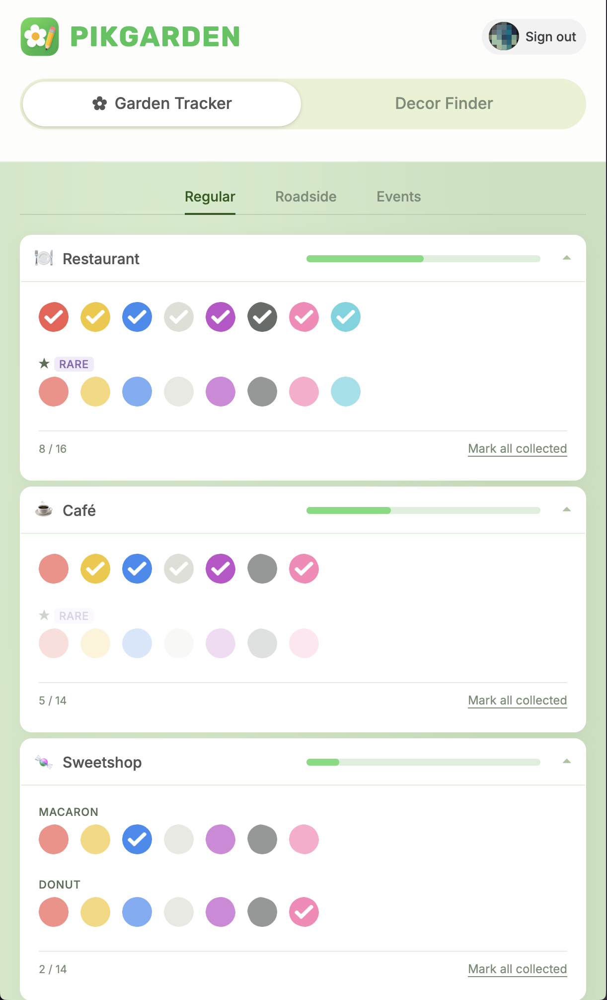
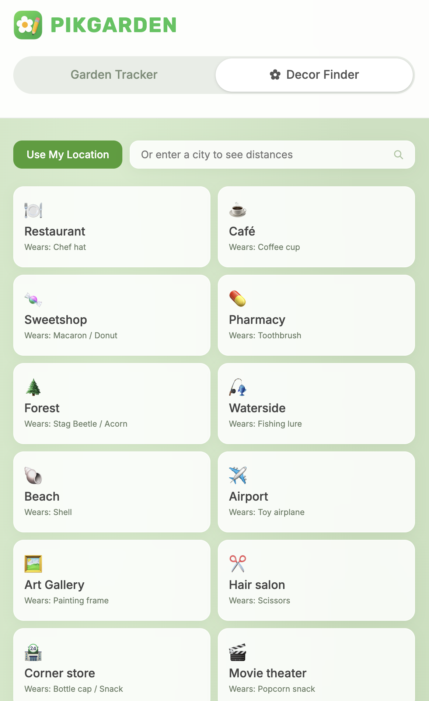

# 🌸 PikGarden

A fan-made tracker for [Pikmin Bloom](https://pikminbloom.com/) decor Pikmin.

**[→ Open PikGarden](https://purrrequest.github.io/PikGarden/)**

---

## What it does

- **Garden Tracker** — mark which decor Pikmin you've already collected, by color and variant
- **Decor Finder** — set your location to find nearby spots where each decor type appears, powered by OpenStreetMap
- **Missing filter** — see only what you haven't collected yet
- Works on mobile and desktop

## About

Built as a personal project by a Pikmin Bloom fan. 
No login, no server — everything is saved locally in your browser.

*Not affiliated with Niantic or Nintendo.*
